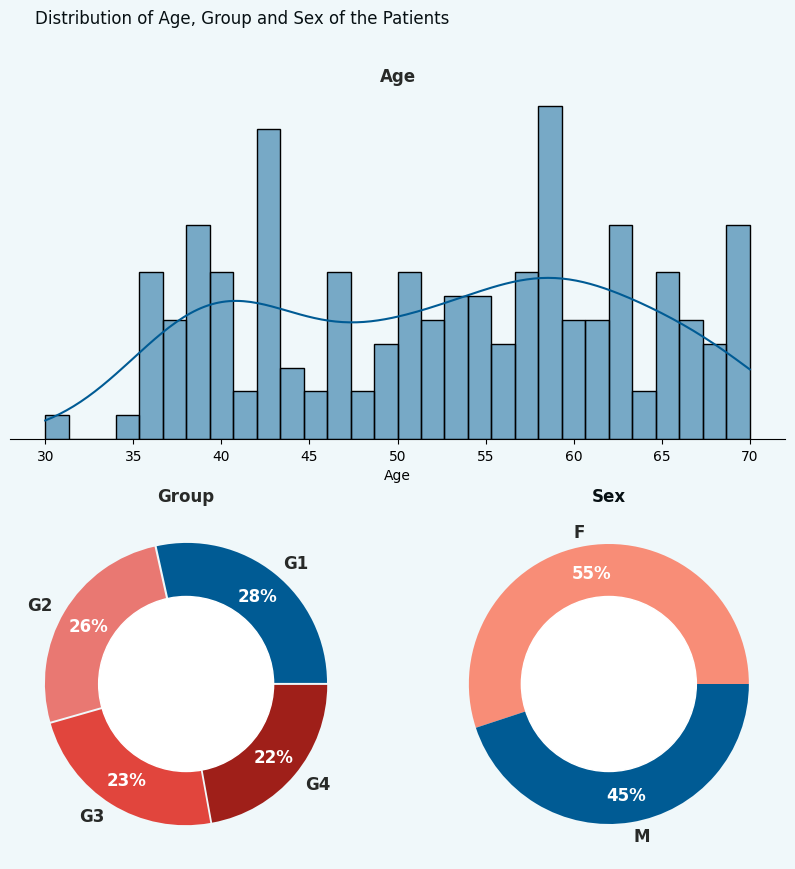
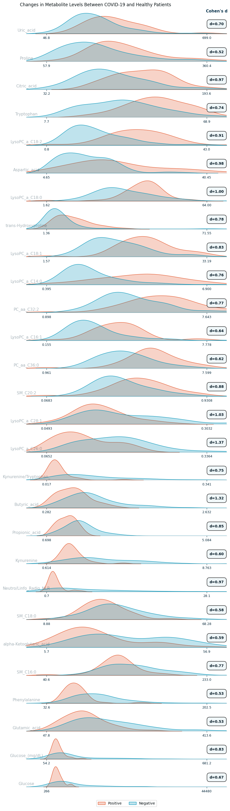
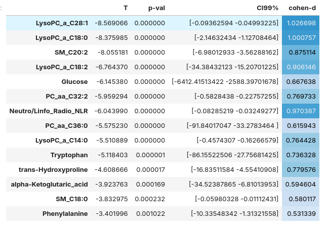
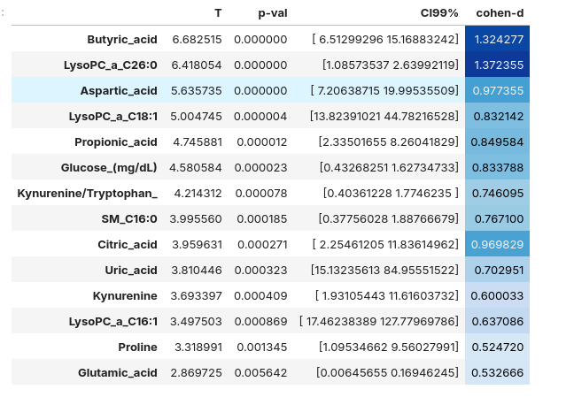

# Metabolite-Dysregulation-in-COVID19-Patients

Small molecules produced by cellular metabolism, called metabolites, are essential for life. They play fundamental roles, including energy production, serving as building blocks for proteins, fats, and nucleic acids, and contributing to cellular structure.

In this notebook, we will analyze samples from 158 patients with and without COVID-19 to identify metabolites dysregulated by SARS-CoV-2 infection in humans. The data were obtained from 158 patients at a local hospital in Zacatecas, Mexico, who were classified by PCR tests as COVID-19 positive (123 subjects) or COVID-19 negative (35 subjects). Furthermore, positive patients were classified by their level of severity as G2 (not-hospitalized), G3 (hospitalized), or G4 (intubated).

### Python Libraries
* Pandas
* Matplotlib
* Seaborn
* Pengouin

### Statistic tools
* Central tendency measures
* Distributions
* Hypotesis tests (t-test, ANOVA)
* Effect sizes (Cohen's d, Explained variance $\eta^2$)
* Conffidence Intervals

## Dataset
The data were originally collected by Yamilé López et al. (2021) from a sample of 158 patients, consisting of 128 COVID-19 positive cases and 35 healthy control subjects. For each patient, 110 metabolites were measured, as well as other clinal/sociodemographical features. In this notebook, We'll be using a cleaned version of the original dataset, and focusing on metabolite data.

## Results

Fourteen metabolites showed significantly decreased levels in COVID-19 patients compared to healthy controls ($p < 0.01$), acording with the t-test for two independent samples. The effect sizes were moderate to large, ranging from 0.52 to 1.02 according to Cohen's d.

Overall, downregulation of these metabolites in COVID-19 patients suggests potential disruptions in various cellular processes, energy metabolism, and possibly the immune response. However, more research is required to fully understand the specific implications for disease progression and potential therapeutic interventions.

Also, fourteen metabolites showd significantly increased levels in COVID-19 patiens compared to healthy controls ($p < 0.01$), according with the t-test for two independent samples. The effect sizes were also moderate to large, ranging from 0.52 to 1.37 standard deviations, according to Cohen's d.

Overall, upregulation of these metabolites in COVID-19 patients suggests potential increases in cellular activity, alterations in energy production, and possibly inflammatory responses. However, further research is crucial to fully understand the specific implications for disease progression and potential therapeutic interventions.
